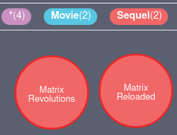

# EPITECH_Workshop_Neo4j

In this workshop you will learn how to use graph database Neo4j. You will be able to representthe content of your databases in the form of a graph.
An introduction to the Cipher language will allow you to easily manipulate complex data schemas.

# Step 1 : Downloads

You can easily download Neo4j with the following link : https://go.neo4j.com/download-thanks.html?edition=community&release=4.0.5&flavour=unix&_ga=2.36738976.1299535582.1592250295-1630072274.1588668299

Oracle JDK 11 is required to use Neo4j, be sure that the JAVA_HOME env variable is set correctly.

# Step 2 : Implement a simple graph data model

Download the following 3 files .csv at the root of the project :

    - movies.csv
    - actors.csv
    - roles.csv
    
(these 3 files are schemas coming from a database, you can export your own dataset in csv format to import them in Neo4j)

Then place the files into the import directory and import the csv files in Neo4j via the binary neo4j-admin import.
You will use the flags --nodes for movies.csv and actors.csv and the flag --relationships for roles.csv.
(Check that the Neo4j database is empty before doing the import :)) : 

./bin/neo4j-admin import --nodes ./import/actors.csv --nodes ./import/movies.csv  --relationships ./import/roles.csv 

# Step 3 : Start Neo4j

Once the import is finished, connect to the Neo4j browser via the command line below:
    
    -./bin/neo4j start

you should get from the console this response: 

    -It is available at http://localhost:7474/

if the previous tasks are successful you can connect to the Neo4j browser.
Neo4j browser will ask you to authenticate, you only need to write "neo4j" as username and password
Then you should see the graphical representation of your datas ! 

# Step 4 : Discover Neo4j

Now that you are connected to Neo4j, feel free to take the time to discover the browser's possibilities (like change colors/size of nodes/ Find attributes/labels of each node).
In the database information tab, you can filter the nodes by choosing options of display, you can also execute queries to modify the graph.

# Step 5 : Cypher query language

From now on, we will try to understand how to manipulate the graph, you will do your first queries in order to display the information you are interested in.
In order to validate this workshop, you will need to save all your queries in a ".txt" file.

I recommend you to tap ":play cypher" into the neo4j console to better understand how use cypher query.

Perform your first queries from the terminal on Neo4j Browser in order to perform precise searches: 
   
    - 1) Make a query that return all nodes in the graph
   

     
    - 2) Make a query that return a particular actor named Keanu Reeves

    - 3) Find a relationship between an actor and movies he played in 
 

    - 4) Find all movies in which Laurence Fishburne played that have the label "Sequel".
 

 
    - 5) Make a query that return all actors that played in Matrix Reloaded
    

 
    - 6) Make a query that return all movies published in 2003
    

    - 7) Create the Agent Smith node with labels: Character and Villain
  
 
 
    - 8) Create Relationship [ACTED_IN] between Agent Smith and the three movies he played in
 
 
 
    - 9) Delete the Agent Smith (Because we don't want him in our graph)
    

# Step 6 : You shall not passed this step !

Clear the current database and import the lord of the rings csv files to Neo4j and feel free to make your own queries in order to manipulate the graph :)
